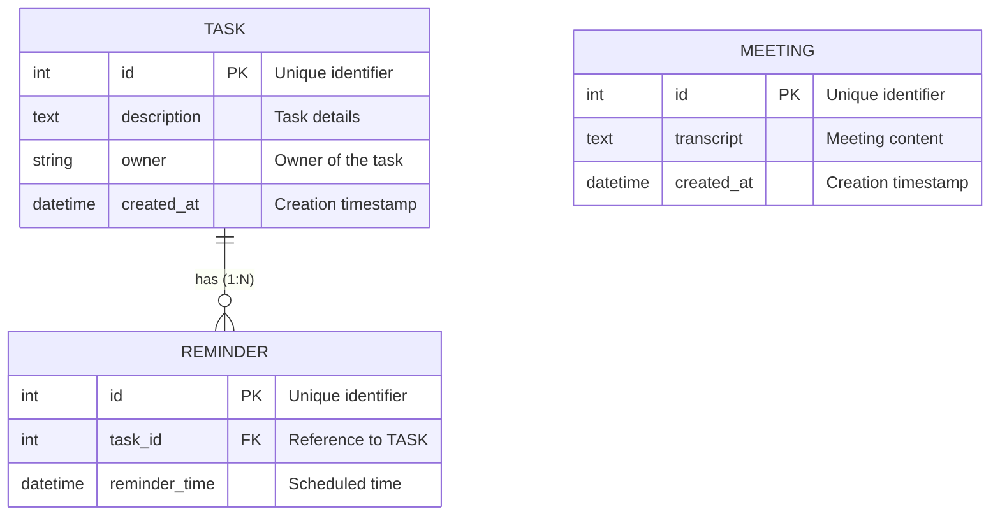
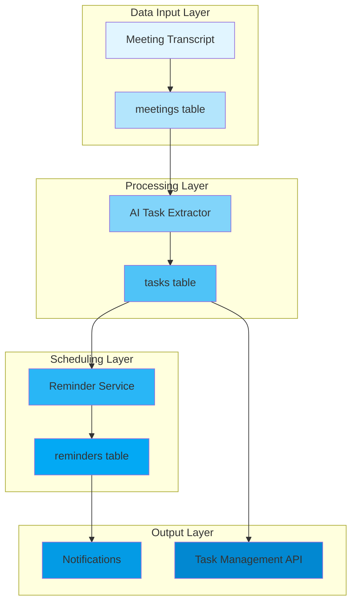
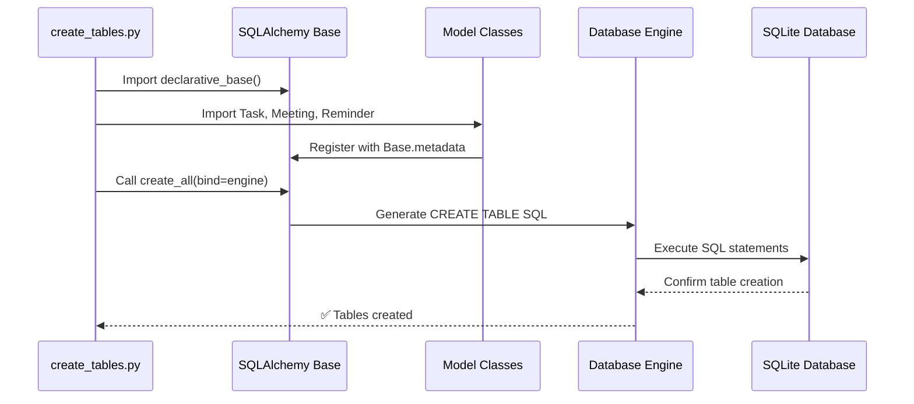
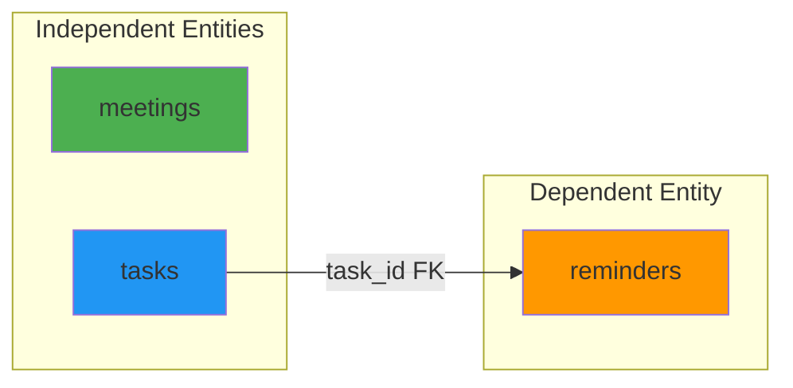

# Database Architecture & Visual Documentation

## 1. Entity-Relationship Diagram (ERD)

### Relationship Explanation
- **`TASK ||--o{ REMINDER`**: One-to-Many relationship
  - One Task can have zero, one, or multiple Reminders
  - Each Reminder must belong to exactly one Task (Foreign Key constraint)

---

## 2. Database Architecture Flow

---

## 3. Table Creation Logic

---

## 4. Data Relationships Graph

---

## 5. Schema Details

### `tasks` Table
- **Purpose**: Central entity for action items
- **Fields**:
  - `id`: Primary Key (auto-increment)
  - `description`: Full task content (Text)
  - `owner`: Assignee name (String)
  - `created_at`: Timestamp (auto-generated)

### `meetings` Table
- **Purpose**: Raw transcript storage
- **Fields**:
  - `id`: Primary Key (auto-increment)
  - `transcript`: Meeting content (Text)
  - `created_at`: Timestamp (auto-generated)

### `reminders` Table
- **Purpose**: Time-based task alerts
- **Fields**:
  - `id`: Primary Key (auto-increment)
  - `task_id`: Foreign Key → `tasks.id`
  - `reminder_time`: Alert trigger time (DateTime)

---

## 6. Initialization Process

### Step 1: Registry Pattern
- `Base = declarative_base()` creates a metadata catalog
- All models inherit from `Base`

### Step 2: Model Registration
- Importing model classes executes their definitions
- `class Task(Base):` automatically registers with `Base.metadata`

### Step 3: Schema Generation
- `Base.metadata.create_all(bind=engine)` inspects registered models
- Generates SQL `CREATE TABLE` statements
- Executes only for missing tables (preserves existing data)
